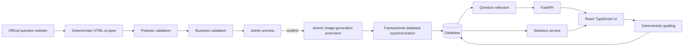

# Architecture

RealiePrep has two deliberately separated workflows.

The React application is built by Vite and served by Nginx. Nginx proxies `/api` to FastAPI.
FastAPI route handlers delegate synchronization, quiz, and statistics behavior to services.
SQLAlchemy models provide database-neutral persistence. SQLite is the default.

Nginx also proxies every `/question-images/` request to FastAPI, so files from an older frontend
image cannot shadow synchronized assets. Each question bank stores images under an immutable path
namespaced by the bank's SHA-256 digest. Confirmation atomically promotes the complete image
directory before committing matching database paths; a database failure moves the images back to
the pending preview. Previous generations remain readable for clients that loaded the old bank
during an update. The digest covers both canonical question data and downloaded image bytes, so an
official image-only update also creates a new generation.

The application image contains no official questions or images. A new installation starts with an
empty migrated database. An administrator explicitly requests a download from NPI; validated content
and assets are then cached in the private persistent data volume. Normal startup never accesses the
official site or overwrites progress.
