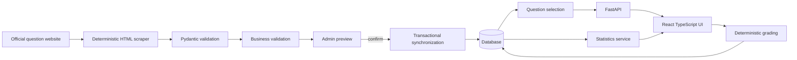

# Architecture

RealiePrep has two deliberately separated workflows.

The React application is built by Vite and served by Nginx. Nginx proxies `/api` to FastAPI.
FastAPI route handlers delegate synchronization, quiz, and statistics behavior to services.
SQLAlchemy models provide database-neutral persistence. SQLite is the default.

The shipped seed is copied into the persistent data volume only when no runtime database exists.
Normal startup never overwrites progress.
