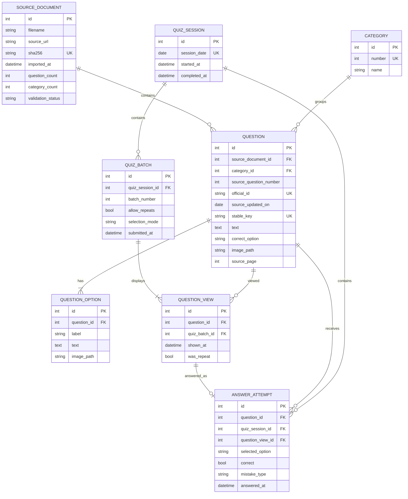

# Database model

`question_views` is the authoritative exposure ledger. Attempts are immutable historical events;
later retries create new views and attempts instead of overwriting earlier performance.
`quiz_sessions.session_date` is derived from `APP_TIMEZONE` (Europe/Prague by default), independent
of the host operating system's timezone.
